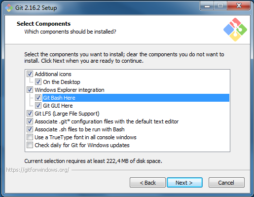
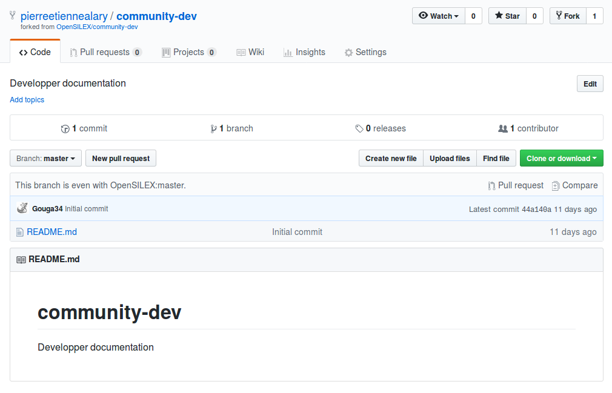

# Versionning using git

This page explains how to contribute to an ongoing OpenSILEX development and what good practices are recommended within the community.

Summary of this chapter's recommendations :
- you can install **git** from [https://git-scm.com/](https://git-scm.com/)
- OpenSILEX repositories are hosted on [OpenSILEX GitHub webpage](https://github.com/OpenSILEX/)
- checkout [GitHub guides](https://guides.github.com) recommendations
- create your own branch of the repository you want to contribute to
- clone your branch in order to perform local modifications
- introduce developments little by little using [GitHub flow](https://guides.github.com/introduction/flow/) :
  1. every morning, check if your branch is up-to-date with the master repository
  2. modify you branch locally
  3. every evening, push to your branch the changes you made locally
  4. create a pull request from your branch when you want to ask for the changes you pushed to your branch to be integrated to the master repository

## Requirements

### Installing git

Install the version control system **git** from [https://git-scm.com/](https://git-scm.com/) or from a terminal, e.g. on a linux terminal :

```
apt-get install git
```

On linux, you can check your version of **git** and display its documentation from the terminal :

```
git --version
git --help
```
If installing **git** on windows, make sure you include "Git Bash Here" in Windows Explorer.



On windows, open **git** from any Explorer window with a right-click > Git Bash Here (instead of Git GUI Here) in order to be able to use the commands presented in this documentation.
At the moment, the present documentation provides no information on how to use Git GUI.


If you are new to **git**, you can check out this [git guide](http://rogerdudler.github.io/git-guide/index.html) and its associated [git cheat sheet](http://rogerdudler.github.io/git-guide/files/git_cheat_sheet.pdf).
The [official GitHub guide](https://guides.github.com/activities/hello-world/) is also worth a read.


### Configurating git

A local configuration of git has to be done only once.
From a terminal (linux terminal, mac terminal, or git bash on windows), you can indicate your name and you email address with the command lines :

```
git config --global user.email "<your email>"
git config --global user.name "<the name that will appear on the git log>"
```

The complete documentation of the git config command is available on [git official website](https://git-scm.com/docs/git-config).

### Join GitHub

Create a GitHub profile on [https://github.com/](https://github.com/).

If you are an INRA agent, you have to specify it on your profile, using the @INRA tag.
You can find more INRA recommendation regarding the use of GitHub on this [document](http://pfl.grignon.inra.fr/gmpaDocs/INRA_UtiliserForge.pdf) from 2017.

You can link your GitHub account to your local **git** from Settings > SSH and GPG keys on any GitHub webpage if you are signed in.

## Join a development

### OpenSILEX repositories

OpenSILEX development projects are organized in separate repositories.
All OpenSILEX repositories are listed in the [OpenSILEX GitHub webpage](https://github.com/OpenSILEX/).

The present repository, *community-dev*, will be used as an example in this section in order to illustrate how to take part in the collaborative development of an OpenSILEX development project.
When collaborating to an other repository, just change *<community-dev>* displayed in the examples to the name of the repository you are interested in.

How to join an ongoing OpenSILEX development project ?

1. Create your own branch of the development project's repository
2. Clone your branch on your computer

### Create a branch

The instructions for creating a branch are available on the official GitHub tutorial : https://help.github.com/articles/fork-a-repo/

First, go with a browser to the URL of the repository you are interested in, e.g. https://github.com/OpenSILEX/community-dev.
From this GitHub webpage, create your own branch of the development project by forking the repository (top-right **Fork** button) :


The workflow described in [GitHub guide](https://guides.github.com/introduction/flow/) is the one used in the OpenSILEX community : each additionnal development is made in separate branches forked from a master branch. The changes made in those branches are then integrated to the master branch through pull requests.

Forking the master branch should lead you to your own branch, accessible through GitHub.
In our example, the branch that has been created by forking *OpenSILEX/community-dev* is accessed to through the URL https://github.com/pierreetiennealary/community-dev.



### Clone your branch

Then, you want to make a local copy of your branch on your computer.
From your branch's GitHub page, copy the URL of your branch you want to clone by clicking on the green **Clone or download** button, on the right of your own repository webpage.


Another option is to download a compressed version of the repository using the **Download ZIP** button.

Choose a local directory on your computer where you want the git repository to be cloned.
There, you can open a terminal and use the `git clone` command.
From an UNIX terminal, the command would be `git clone https://github.com/[your_username]/[repository_name].git`.

Using SSH is preferable to the HTTPS protocol (in order not to have to provide your username each time you want to update your branch) :

```
TODO git ssh git@github.com:pierreetiennealary/community-dev.git
```

see also https://help.github.com/enterprise/2.12/user/articles/generating-a-new-ssh-key-and-adding-it-to-the-ssh-agent/

The alternative (less recommended) is using `git clone` :

```
git clone https://github.com/pierreetiennealary/community-dev.git
```

The URL to be used after `git clone` can be found by clicking on the green **Clone or download** button of the repository main webpage.


then :

`git remote -v`

`git remote add upstream https://github.com/OpenSILEX/community-dev.git`

## Edit a development (short)

1. before any modification to your branch, verify that it's up-to-date with the master branch : `git ???`
2. add your local modifications to your branch as you ??? : `git add`
3. todo

## Edit a development (detailed)

On the local repository cloned from your branch, so can create, read, edit and delete files and folders.
For example, I have created the present file called *github.md*.
The modifications

### checkout

### fetch upstream

(you didn't make new modifications to you branch since your last git push)

`git fetch upstream`

`git rebase`

### add

which files have been modified ?

`git status`


Note that you can use `git status -s` for a shorter answer (less verbose).

check the changes made to a file with `git diff <filename>`.

`git add` followed by the name of the file you created or changed, e.g. this markdown document *github.md*.


git status -> it's green !

Note that the command is also `git add` when you remove a file locally and then want it to be removed from the repository.


### commit

enregistrement des modifications locales vers sa branche

git commit -m "github.md added"


### push

```
git push origin master
```

### pull request


## Good practices

- `git checkout` and `git pull` every morning before working on a development
- check for typos and errors before `git commit`
- `git push` every evening after working on a development
