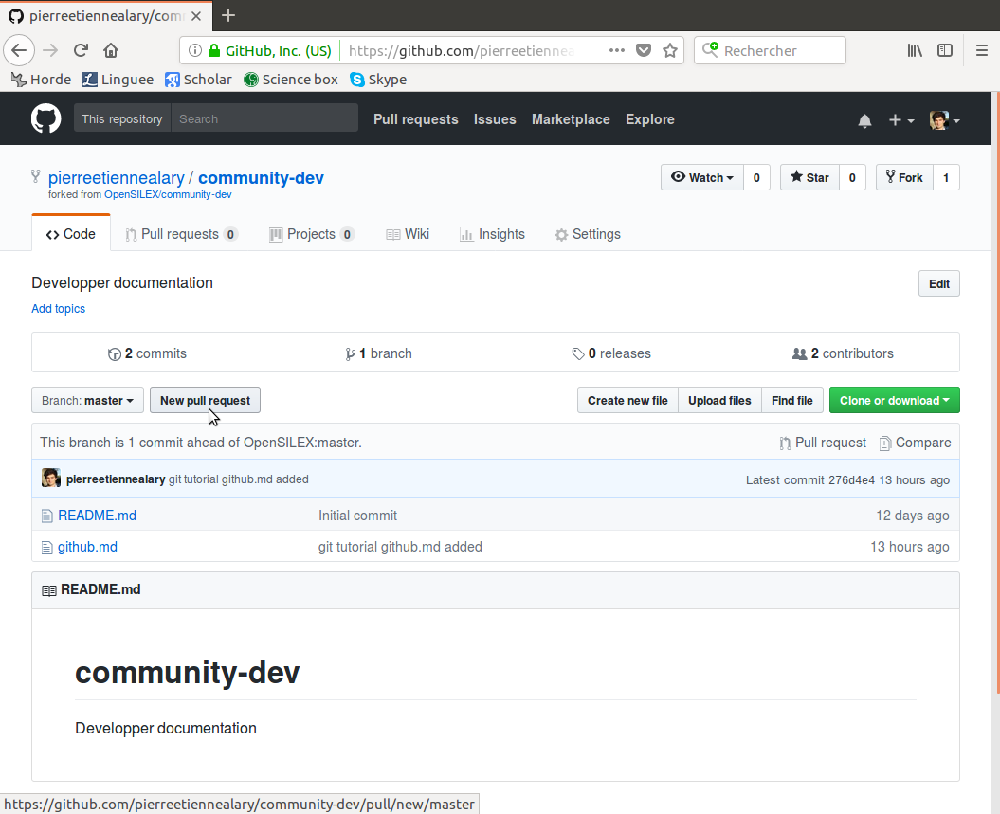
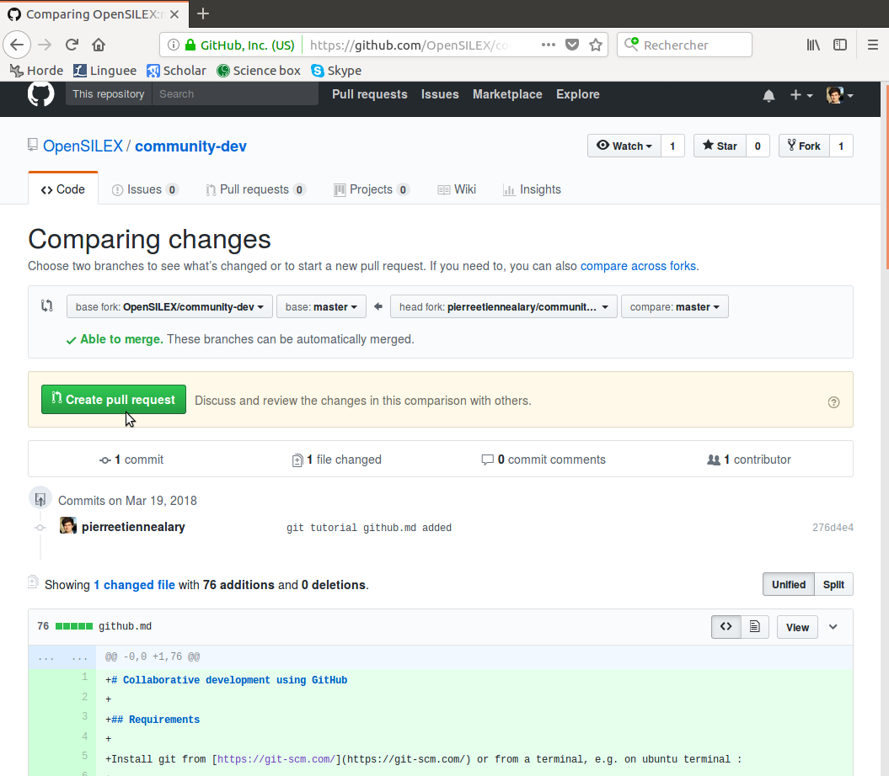

# Using git

This page explains how to contribute to an ongoing OpenSILEX development and what good practices are recommended within the community.

## Requirements

Install git from [https://git-scm.com/](https://git-scm.com/) or from a terminal, e.g. on ubuntu terminal :

```
apt-get install git
```

On linux, you can check your version of git and display its documentation using :

```
git --version
git --help
```

If you are new to git, you can check out this [git guide](http://rogerdudler.github.io/git-guide/index.html) and its associated [git cheat sheet](http://rogerdudler.github.io/git-guide/files/git_cheat_sheet.pdf).

Create a GitHub profile on [https://github.com/](https://github.com/).
You can find INRA recommendation regarding the use of GitHub on this [document](http://pfl.grignon.inra.fr/gmpaDocs/INRA_UtiliserForge.pdf) from 2017.

## Join a development

### OpenSILEX repositories

OpenSILEX development projects are organized in separate repositories.
All OpenSILEX repositories are listed in the [OpenSILEX GitHub webpage](https://github.com/OpenSILEX/).

The present repository, *community-dev*, will be used as an example in this section in order to illustrate how to take part in the collaborative development of an OpenSILEX development project.
When collaborating to an other repository, just change *[community-dev]* displayed in the examples to the name of the repository you are interested in.

How to join an ongoing OpenSILEX development project ?

1. Create your own branch of the development project's repository
2. Clone your branch on your computer

### Create a branch

First, go with a browser to the URL of the repository you are interested in, e.g. https://github.com/OpenSILEX/community-dev.
Create your own branch of the development project by forking the repository (top-right **Fork** button) :


The workflow described in [GitHub guide](https://guides.github.com/introduction/flow/) is the one used in the OpenSILEX community : each additionnal development is made in separate branches forked from a master branch. The changes made in those branches are then integrated to the master branch through pull requests.

Forking the master branch should lead you to your own branch, accessible through GitHub.
In our example, the local branch is access to through the URL https://github.com/pierreetiennealary/community-dev :


### Clone your branch

Then, you want to make a local copy of your branch on your computer.
From your branch GitHub page, copy the URL of your branch you want to clone by clicking on the green **Clone or download** button, on the right of your own repository webpage.


Another option is to download a compressed version of the repository using the **Download ZIP** button.

Choose a local directory on your computer where you want the git repository to be cloned.
There, you can open a terminal and use the `git clone` command.
From an UNIX terminal, the command would be `git clone https://github.com/[your_username]/[repository_name].git`.
For me it was :

```
git clone https://github.com/pierreetiennealary/community-dev.git
```

The URL to be used after `git clone` can be found by clicking on the green **Clone or download** button of the repository main webpage.


## Edit a development (short)

1. before any modification to your branch, verify that it's up-to-date with the master branch : `git ???`
2. add your local modifications to your branch as you ??? : `git add`
3. todo

## Edit a development (detailed)

On the local repository cloned from your branch, so can create, read, edit and delete files and folders.
For example, I have created the present file called *github.md*.
The modifications

### checkout

### get

todo

### add

`git status`


Note that you can use `git status -s` for a shorter answer (less verbose).

`git add` followed by the name of the file you created or changed, e.g. this markdown document *github.md*.


git status -> it's green !

Note that the command is also `git add` when you remove a file locally and then want it to be removed from the repository.


### commit

enregistrement des modifications locales vers sa branche

git commit -m "github.md added"


### push

```
git push origin master
```

### pull request






## Good practices

- `git checkout` and `git pull` every morning before working on a development
- check for typos and errors before `git commit`
- `git push` every evening after working on a development
