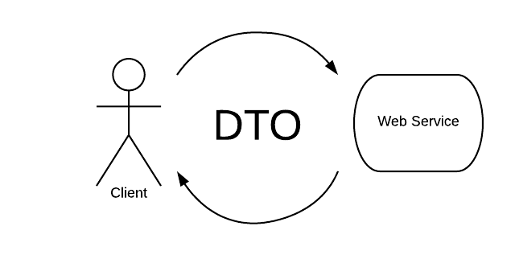
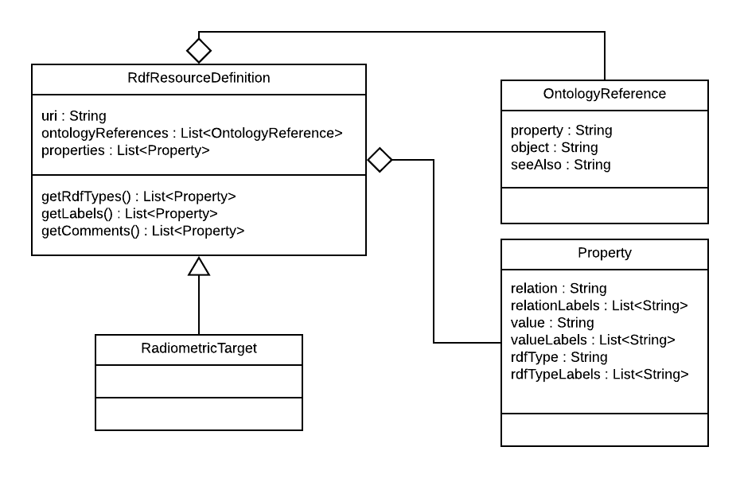
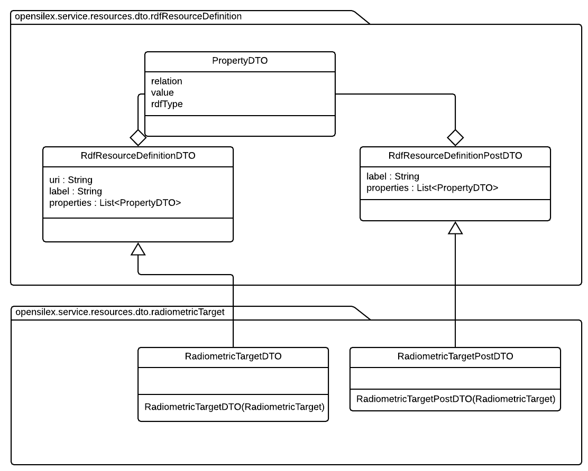

# Web Service

## Software Architecture

We are using the DTO (Data Transfert Object) and the DAO (Data Access Object) design patterns.

### DTO


The DTO objects corresponds to the formats used to exchange with the clients.

### DAO


The DAO (Data Access Object) manipulates only models. It does the CRUD access to the different data sources (e.g. triplestore, relational database, nosql, other web services, ...).

### Models
The models are used to represents the concepts which are gonna be manipulated inside the web service. The DAO only manipulates models and does not know the DTO structures. Before using a DAO, we must convert the DTO given by the user in a model. The DAO will then return a model which will be converted in the DTO corresponding to the representation of the object that will be returned.


## Rdf Resource Definition
To represents and manipulate the triplestore resources (instances or concepts), we have created models, DAO and DTO.

### Rdf Resource Definition model
To manipulate a resource (instance or concept), we extends the RdfResourceDefinition model, such as the following example.



### Rdf Resource Definiton DTO
A few services returns more or less the same rdf resource definition JSON format. We have created a few DTO which are extended. In the following example, the RadiometricTargetDTO extends the RdfResourceDefinitionDTO and the RadiometricTargetPostDTO extends the RdfResourceDefinitionPostDTO. We have created a specific package which will contain all the DTO of the radiometric targets.



### Property DAO
To manipulate the properties extracted from a semantic triplestore, we use the PropertyDAOSesame class.


## Java Bean Validation (JSR 380)

When you create a new service, you must use the [Java Bean Validation](https://beanvalidation.org/2.0/spec/#builtinconstraints) to validate the input parameters. The JSR 380 uses annotations to validate parameters.

### Use an existing constraint validation

You can add a verification on the DTO for the post and the ResourceService classes for the get parameters. To do that, you must add an annotation such as `@Required`.

In the folowing example, the parameter `url` of the method `get` of the `ExampleResourceService` is required (`@Required`) and must be a valid url (`@Url`).

For the `post` method, we needs to validate the list of `ExampleDTO`. The `@Valid` annotation is used to validate the attributes of a complex object. In the following example, the `@Valid` is used to validate the content of the list `examples` of the `post` method, in `ExampleResourceService`.

The `ExampleDTO` class contains the constraint validation of its attributes. The constraint annotations are in our case applied to the `getter` methods. For example, the url attribute is required (`@Required`) and must be a valid url (`@Url`). The secondExample parameter is a complex type. To validate it, we use the `@Valid` annotation as the explained earlier.


```java
public class ExampleResourceService {

  @GET
  public Response get(
    @QueryParam("url") @Required @URL String url
  ) {
    ...
  }

  @POST
  public Response post(ArrayList<ExampleDTO> @Valid examples) {
    ...
  }
}

public class ExampleDTO {
  String url;
  SecondExample secondExample;

  @URL
  @Required
  public String getUrl() {
    return url;
  }

  @Valid
  public SecondExample getSecondExample() {
    return secondExample;
  }
}
```

### Create a custom constraint validation

You can create custom constraint validation. For examplen the `@URL` is define in the following code blocks.

In our case, create the custom validation annotation in the package `service.resources.validation.validators`.

```java
public class URLListValidator implements ConstraintValidator<URL, List<String>> {

    @Override
    public void initialize(URL constraintAnnotation) {
    }

    @Override
    public boolean isValid(List<String> valueList, ConstraintValidatorContext context) {
        if (valueList == null) {
            return true;
        }

        Boolean allValid = true;
        String lastUrlCheck = null;

        // loop over string
        for (String url : valueList) {
            final java.net.URL finalUrl;
            lastUrlCheck = url;
            try {
                finalUrl = new java.net.URL(url);
            } catch (MalformedURLException e1) {
                allValid = false;
            }
        }

        // if not valid returns the last false index
        if (!allValid) {
            context.disableDefaultConstraintViolation();
            context.buildConstraintViolationWithTemplate(
                    "The string at the index [" + valueList.indexOf(lastUrlCheck) + "] is not an URL"
            ).addConstraintViolation();
        }

        return allValid;
    }
}
```

Create the custom validation annotation interface in the package `service.resources.validation.interfaces`.

```java
@Target(value={METHOD,FIELD,ANNOTATION_TYPE,CONSTRUCTOR,PARAMETER}) //The annotation can be applied to a method, a parameter, etc.
@Retention(RUNTIME) //The annotation should be available for reflection at runtime. Example : @Deprecated (see https://docs.oracle.com/javase/7/docs/api/java/lang/annotation/RetentionPolicy.html)
@Constraint(validatedBy = {URLValidator.class,URLListValidator.class}) //The constraint is validated by the URLValidator and the URLListValidator (to validate lists of url)
public @interface URL {
    String message() default "is not an URL"; //The message element value is used to create the error message. (see https://beanvalidation.org/2.0/spec/#validationapi-message)

    Class<?>[] groups() default {}; //Every constraint annotation must define a groups element that specifies the processing groups with which the constraint declaration is associated. The type of the groups parameter is Class<?>[] (see https://beanvalidation.org/2.0/spec/#constraintsdefinitionimplementation-constraintdefinition-properties-groups)

    Class<? extends Payload>[] payload() default {}; //The annotation should be available for reflection at runtime. (see https://beanvalidation.org/2.0/spec/#constraintsdefinitionimplementation-constraintdefinition-properties-payload)

    /**
     * This code block is used to apply the validator to a list of elements.
     */
    @Target(value = {METHOD,FIELD,ANNOTATION_TYPE,CONSTRUCTOR,PARAMETER})
    @Retention(RUNTIME)
    @Documented //Apply @Documented when defining an annotation, to ensure that classes using your annotation show this in their generated JavaDoc.
    public @interface List {
        public URL[] value();
    }
}
```
You can then use your custom constraint validator such as the [built in constraints](https://beanvalidation.org/2.0/spec/#builtinconstraints) by using `@URL`.

When you use a built in constraint validation, please check if the annotation can be applied on lists (not all built in constraint are implemeted for lists).

Several annotations don't work on `List`. For example, `@Email` only works on `String`. You can create your own validator as showed above or use type level annotations. In Bean Validation (2.0), all provided constraints have `ElementType.TYPE_USE`. For more information [reads the definition](https://docs.oracle.com/javase/8/docs/api/java/lang/annotation/ElementType.html) .
For example, if the annotation type `@Email` is meta-annotated with @target(ElementType.TYPE_USE), then  `ArrayList<@Email String>` could be treated by a type checker as indicating that all string of this ArrayList are well formatted e-mails.

The example below shows how to work with list of emails using `@Email`.

```java
public ArrayList<@Email String> getUsersEmails() {
       return usersEmails;
   }
```

For more examples see the others custom constraints validators of the web services in the packages `service.resources.validation.validators` and `service.resources.validation.interfaces`.
